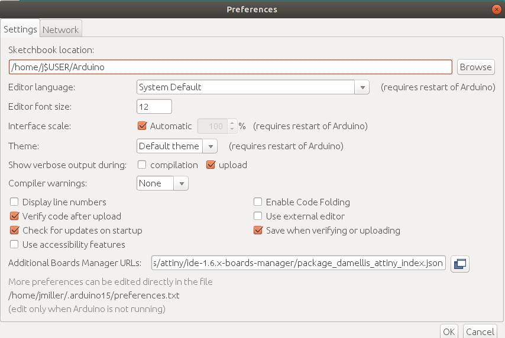

# LED Christmas Tree

Give the gift of hacking. This is a great project to learn how to program or just enjoy the existing sketch.

## Background
I originally made this for my daughters when they were part of a community group for young entrepreneurs. The LED Christmas Tree was designed to be a product for them to build and sell. ThreeGirlsMakeStuff is now defunct.

## Programming

Supplies:
- [SparkFun ISP Pogo Adapter](https://www.sparkfun.com/products/11591)
- [USB Tiny AVR](https://www.aliexpress.com/item/1005003257284683.html?spm=a2g0o.productlist.0.0.764f665euosCDP&algo_pvid=e8b9d653-d5cf-4580-b718-6405428d7faf&algo_exp_id=e8b9d653-d5cf-4580-b718-6405428d7faf-10&pdp_ext_f=%7B%22sku_id%22%3A%2212000024884249441%22%7D)

The easiest thing to do is solder the Tiny AVR to the ISP Pogo Adapter.

- Click on File>Preferences 
- Add this to Additional Boards Manager URLs: ``https://raw.githubusercontent.com/damellis/attiny/ide-1.6.x-boards-manager/package_damellis_attiny_index.json`` 
- Click on Tools>Board>Board Manager
- Search for `attiny85` and install 
- Select ``ATtiny85``, ``Internal 8MHz``
- Click on Sketch>Include Library>Library Manager
- Search for Neopixel 


You can use any of the NeoPixel example sketches. Use the following configuration.

````c
#include <Adafruit_NeoPixel.h>
#ifdef __AVR__
  #include <avr/power.h>
#endif

#define PIN 0
#define NUM_LEDS 10
#define BRIGHTNESS 15

Adafruit_NeoPixel strip = Adafruit_NeoPixel(NUM_LEDS, PIN, NEO_GRB + NEO_KHZ800);
```
